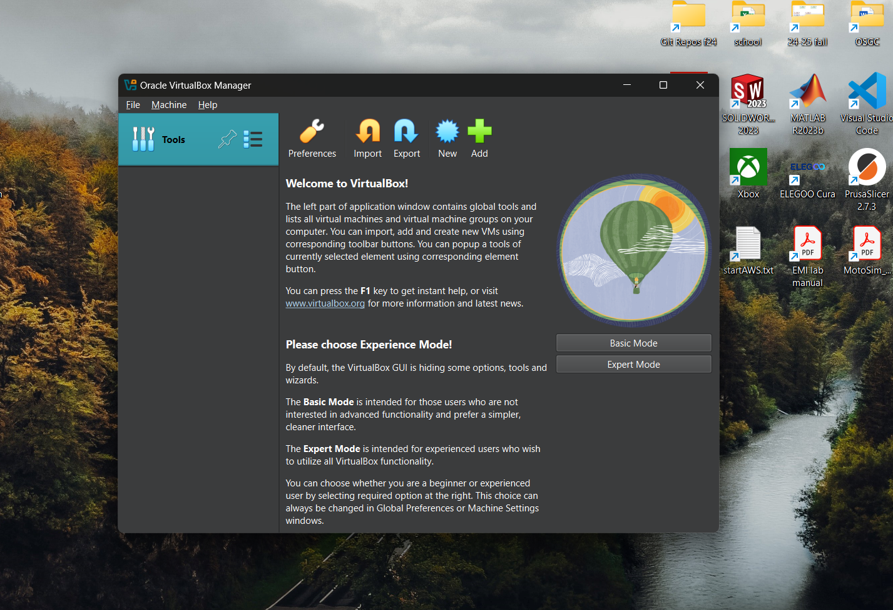
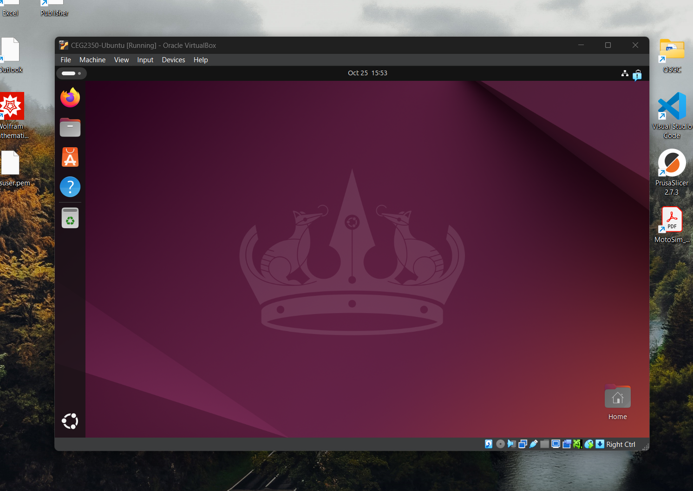

## Lab 07

- Name: Rachael Ballentine
- Email: ballentine.7@wright.edu
- Date: 10/25/24

## System Discovery

1. CPU info:
    - CPU brand: `Intel`
    - Number of cores: `12`
    - Number of logical cores: `16`
2. GPU info:
    - Integrated GPU info:  `Intel Iris Xe Graphics`
    - Dedicated GPU info: `n/a`
    - Link to driver software for GPU: `https://www.intel.com/content/www/us/en/download/785597/intel-arc-iris-xe-graphics-windows.html`
3. Memory info:
    - Physical memory (RAM) size (in GB): `16 GB`
    - Virtual memory size (in GB): `10.752 GB`
4. Storage info (repeat for each disk attached to your system): 
    - Disk 1 type: `NVMe`
    - Disk 1 manufacturer and model: `Western Digital SN 740`
    - Total disk 1 size (in GB): `1 TB = 1000 GB`
5. Primary partition info:
    - Primary partition mount point: `931.58 GB`
    - Remaining space on primary partition (in GB): `425 GB` 
    - Filesystem on primary partition: `NTFS`
6. BIOS / UEFI info: 
    - BIOS or UEFI version: `UEFI, version Dell Inc. 1.17.0`
    - How to access your BIOS / UEFI: `restart and press the keyboard key to enter bios while rebooting. for Dell the key is F2`
7. Kernel / OS info:
    - Bootloader software on your system: `UEFI Boot manager`
    - Kernel version of your operating system: `10.0.22631 Build 22631`
    - Operating System name & version: `Windows 11 Home`

## Part 2 - Virtualize the Machine

1. Virtual Machine Manager:
    - Software & version: `VirtualBox 7.1.4`
    - Link to software URL: `https://www.virtualbox.org/wiki/Downloads`
    - 

2. Guest OS information: 
    - Linux distribution selected: `Ubuntu 24.04.1 LTS`
    - URL downloaded from: `https://ubuntu.com/download/desktop`

3. Guest VM resource allocations:
    - Number of Virtual CPUs: `4`
    - RAM: `4 GB`
    - Hard disk space: `35 GB, since OS base requirement was listed as 25`

4. Guest OS Installation:
    - Note steps completed to install and then run the guest operating system
      ```
      1. after starting VM, make sure to select "TRY/INSTALL Ubuntu"
      2. In installation menu, select "Install Ubuntu"
      3. Select "Interactive Installation"
      4. Select "Default selection"
      5. When asked about proprietary software, check both boxes
      6. Select "erase disk and install" 
      7. Set up username, PC name, and password
      8. Select timezone
      9. Install!
      ```
    - 

## Part 3 - Virtual Playground:

1. How to change your desktop background in your VM:
2. How to install VSCode in your VM:
3. How to connect to your AWS instance from your VM using `ssh`:
