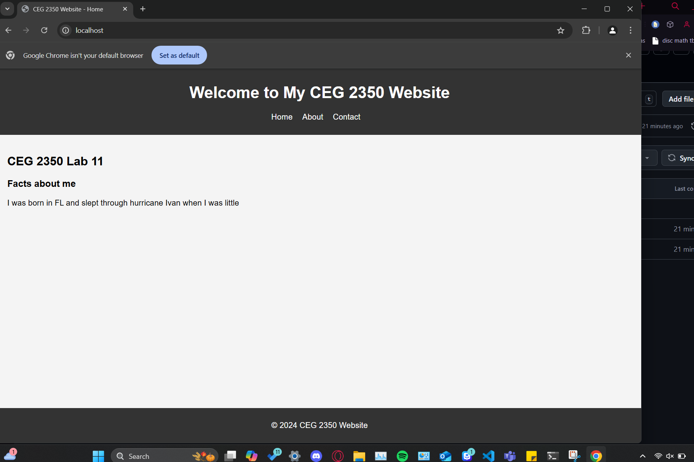

## Lab 11

- Name: Rachael Ballentine
- Email: ballentine.7@wright.edu
- Date: 11/22/24

## Part 1 Answers:

1. `tar` options:
   - `-c` : `create new archive`
   - `-v` : `list files as tar compresses them (progress)`
   - `-f` : `specify file name type of archive file`
   - `-z` : `compress the archive using gzip`
   - `-x` : `extract from an archive`
2. Command(s) to create and compress your archive: 
`tar czf f24labs-compressed.tar.gz /home/ubuntu/ceg2350f24-rballentine25/f24LABS`

## Part 2 Answers:

1. Command to connect with `sftp`: `sftp 2350`
2. `sftp` options:
   - `ls` : `lists all files in current remote directory (whatevery youre connected to 
via ssh`
   - `lls` : `lists all files in the current local directory (from host machine)`
   - `put` : `uploads a local file from the local directory to the current remote directory`
   - `get` : `downloads a file from the remote directory to the local directory`
3. Command(s) to use `sftp` to download your `.tar.gz` file to your system:
 `while connected and in correct directory, "get f24labs-compressed.tar.gz"
4. Command(s) to decompress & extract your `.tar.gz` file to your system: 
 `tar -xf f24lab-dl-files.tar.gz` 

## Part 3 Answers:

1. Command to install `apache2` or `nginx`: `sudo apt install apache2`
2. Command to confirm that web serving service is running: `systemctl status apache2` or `ps aux | grep apache2`
3. Command to download [`simple-site.tar.gz`](simple-site.tar.gz) to your AWS instance: `wget https://github.com/pattonsgirl/CEG2350/raw/refs/heads/main/Labs/Lab11/simple-site.tar.gz`
4. Command(s) to change permissions: 
``` 
sudo chgrp -hR ubuntu:ubuntu /var/www/html (to recursively change owner and group)
sudo chmod 771 /var/www/html
```
5. Command to extract the compressed archive to `/var/www/html`:
`"tar -xvf simple-site.tar.gz -C /var/www/html", -C allows to be saved to specified path`
6. Required changes to `index.html` will be awarded credit based on screenshot.
7. 
```
i could not for the life of me figure out how to get to "my website" from my aws instance. i tried running "hostname -I"
to get the IP and then going to "http://10.0.0.25" in my browser, and it would never connect (said it wasnt responding).
I redid all the steps in my local WSL2 terminal and thats how I got the screenshot. 
```

## Part 4 Answers:

1. Command to generate a new key, with options entered into the fields 
```
Enter command & options entered while running here
```

2. Create the user and / or prove the user exists
```
Enter command & output for creating user and / or proving user exists.
```

3. Contents of `~/.ssh/authorized_keys` in remote user account:
```
Enter contents here
```

4. `ssh` command:

5. Updated `config` file contents:
```
Enter block with connection information in config file here
```

6. `ssh` command post `config` file entry:
