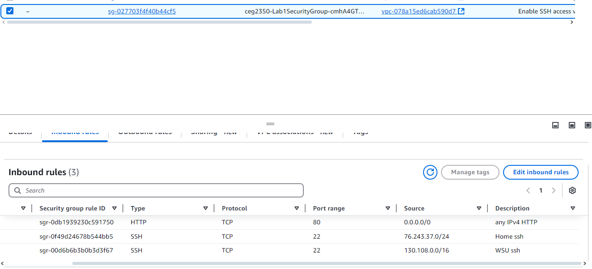

## Lab 12

- Name: Rachael Ballentine
- Email: ballentine.7@wright.edu

## Part 1 - Linux Network Command Cheat Sheet

- `hostname` 
``` 
displays the system's host name (DNS name) and allows you to change it. 
Includes flags like -i/I to get all IP 
addresses and -b to set/change the hostname. 
```
    - Resource on `hostname`: https://www.geeksforgeeks.org/hostname-command-in-linux-with-examples/

- `ifconfig`
```
ifconfig is part of the net-tools linux toolpack for network interface configuration. 
Man linux entry says it prints the status of currently active interfaces when called without arguments.
includes flags to specify the interface to change, as well as flags to activate/deactivate a specific
interface, and ways to change networks mask and broadcast mask for a specific interface. 
```
    - Resource on `ifconfig`: https://phoenixnap.com/kb/linux-ifconfig

- `ip a`
```
command for network configuration, allows interaction with network interfaces, routing tables, etc. 
replacement for ifconfig. has to be given a networking component to work with, then can perform commands
like "address" to display ip addresses associated with the component, "route", "add", "del", etc
```
    - Resource on `ip`: https://www.geeksforgeeks.org/ip-command-in-linux-with-examples/

- `route`
```
displays the IP routing table and can be used to modify it. running w/o flags will display the routing
table entries. flags include del/add to delete or add, target to specify destination, gw to route via
a gateway, etc etc etc
```
    - Resource on `route`: https://www.computerhope.com/unix/route.htm

- `iptables -L`
```
iptables allows configuration of the linux firewall. it lets the user define chained rules for incoming
and outgoing network traffic. iptables is made up of tables with rule chains. -L flag lists all the rules 
in a chain. 
```
    - Resource on `iptables`: https://phoenixnap.com/kb/iptables-linux

- `curl <IP_or_hostname>`
```
curl is a command to transfer data across severs. can transfer data using HTTP, HTTPS, FTP, etc. most 
simple use is just to fetch a web page, ex "curl https://wttr.in". allows for resume of transfers, user
auth, bandwidth limitation, etc
```
    - Resource on `curl`: https://linuxize.com/post/curl-command-examples/

- `ping <IP_or_hostname>`
```
ping is a tool to test network connectivity by sending out an echo to request packets from the target host.
it waits until it gets a reply and iforms the user of the round trip time and packet loss. has options like 
-c to specify number of ping requests sent, -i for wait interval, -I to set source, etc.
```
    - Resource on `ping`: https://www.hostinger.com/tutorials/linux-ping-command-with-examples#:~:text=The%20Linux%20ping%20command%20is%20a%20tool%20for%20testing%20connectivity,%2C%20domain%2C%20or%20IP%20address.

- `nslookup <IP_or_hostname>`
```
nslookup is name server lookup and lets the user find an ip address or DNS record for a specified domain name. 
ex. if you want the ip address of a specific website. also works other way arround: can find domain name with
just ip address. works by entering just "nslookup" on command line, then using secondary commands in the prompt
that appears. 
```
    - Resource on `nslookup`: https://nordvpn.com/blog/nslookup-command/

- `traceroute <IP_or_hostname>`
```
tracks the path that a packet takes from the source to the destination (ex user's device to a website) over
an IP newtork. includes info about how many routers the packet had to go through. options include -4 and -6
to indicate ipv4 or ipv6, -m to set max hops, -p for dest port, etc. 
```
    - Resource on `traceroute`: https://www.geeksforgeeks.org/traceroute-command-in-linux-with-examples/

- `nmap -p <IP_or_hostname>` 
```
nmap is network mapper which is network tool. allows adnins to see hosts and services on systems. can use server
names, ipv4, or ipv6. includes various flags that can be used to specify which info to look for.
```
    - Resource on `nmap`: https://phoenixnap.com/kb/nmap-commands

- `tcpdump -i <networkinterface> -n host <IP_or_hostname>`
```
tcpdump allows system admins to analyze TCP/IP packets moving through the system/over the network. can 
also be used as a security tool. has flags like -c to exit after rercieving a certain number of packets, 
-i to specify where to capture packeets from, etc.
```
    - Resource on `tcpdump`: https://www.geeksforgeeks.org/tcpdump-command-in-linux-with-examples/

## Part 2 - Network Info

### Network Info for Windows 11

1. Hostname of the device: `RachaelsLaptop`
2. MAC address of the NIC connected to the network: `"Physical Address": BC-03-58-D3-FD-B5`
3. IPv4 address: `10.17.241.15 (private)`
4. Subnet mask: `255.255.0.0`
5. Gateway address: `"Default Gateway": 10.17.0.1`
6. Does the device use DHCP to receive a network address? (y/n): `Yes`
7. DNS server address: `130.108.128.200`
8. Public IPv4 address: `130.108.104.154`
```
answers for 1-7 found using "ipconfig /all" in PowerShell
answer for 8 found using ipinfo.io
```

### Network Info for AWS Instance

1. Hostname of the device: `ip-10-0-0-25`
2. MAC address of the NIC connected to the network: `"link/ether": 0a:ff:c2:af:4c:d5`
3. IPv4 address: `"inet": 10.0.0.25`
4. Subnet mask: `"netmask": 255.255.255.0`
5. Gateway address: `0.0.0.0`
6. Does the device use DHCP to receive a network address? (y/n): `yes`
7. DNS server address: `127.0.0.53`
8. Public IPv4 address: `52.73.170.36`
```
ansert for 2 found with "ip a"
answer for 1, 3-4, 6 found with "ifconfig": for 6, dynamic keyword was used in inet line
answer for 5 found with "route"
answer for 7 found with "nslookup -> server"
answer for 8 found by "curl https://ipinfo.io"
```

## Part 3 - Subnet Translation

Translate the below CIDR blocks to their IP ranges:
1. `130.108.0.0/16` = `130.108.0.0 to 130.108.255.255`
2. `34.117.59.81/32` = `just 34.117.59.81`
3. `10.25.121.90/8` = `10.0.0.0 to 10.255.255.255`

Translate the below IP ranges to their CIDR notation subnets:
1. `172.18.5.0 - 172.18.5.255` = `/24`
2. `5.9.243.187 - 5.9.243.187` = `/32`
3. `192.168.0.0 - 192.168.1.255` = `/23`

## Part 4 - Security

Screenshot of your changed Inbound Security Group rules.  

> Why should HTTP allow any IP, while SSH has restrictions?
```
we're assuming that any HTTP application would be publiclly available to view, like a 
website, so it would need to allow any IPs to request information from it. SSH is meant
to be a secure connection between two trusted devices so needs to only allow specific 
IPs to access it. 
```
> Describe how you validated or can validate if your rules are working with the restrictions given.
```
I know my WSU ssh rule works because it was the first one I did (while I was at home)
 and it wouldn't let me ssh back into my AWS instance after I set the rule. 
I know my home rule works because after I set that one up, then I COULD get into
my AWS at homme.
```

## Part 5 - It's Alive!  Maybe...

1. For the given server IP, describe purpose and what types of requests it does / doesn't respond to:
    - `8.8.8.8`
        - Purpose: `Google DNS service to find ips/domain names`
        - Responds to: `ping, nmap, traceroute, nslookup. opens a website when typed in a browser`
        - Does not respond to: `curl, tcpdump`  
	`nmap found ports 53 and 443 open for tcp, 443 was for https`
    - `5.9.243.187` -> `wttr.in` -> `https://wttr.in`
        - Purpose: `online weather app made of ascii characters`
        - Responds to: `ping (not with http), nslookup, curl, traceroute. opens website in browser` 
        - Does not respond to: `tcpdump`  
	`nmap found 9 ports open, including 80 and 443 for http and https`
    - Your AWS instance public IP
        - Purpose: `gives me access to AWS?`
        - Responds to: `ping worked, but had 100% data loss (no packets returned). nmap, nslookup, curl 
	all worked. traceroute worked but had really weird output (30 hops, all "* * *"). also brought up
	a webpage in browser (lab 11 html webnsite)`
        - Does not respond to: `n/a`  
	`from my home network, nmap found only one port open, port 80 for http. this confirms my inbound 
	security group rule worked`
    - `34.117.59.81` -> `ipinfo.io` -> `https://ipinfo.io`
        - Purpose: `shows the public ip address and info for the contacting device`
        - Responds to: `ping, nmap, traceroute, nslookup (only ip and JUST "ipinfo.io"). curl works but only 
	on full address with http or https, not the ip address (gets "fault filter abort" messawdw)`
        - Does not respond to: `putting the ip address in browser search bar brings up a blank page with just
	the words "fault filter abort". putting hostname in browser pulls up the website.`  
	`nmap found 2 ports open, 80 and 443 for http and https`  
2. Does `ping` tell you if a server is "working"? 
``` 
not necessarily, since ping can be blocked by firewalls 
source:
“Understanding the ping command in network troubleshooting and monitoring,” Kentik, Jun. 07, 2024. 
Available: https://www.kentik.com/kentipedia/ping-command-in-network-troubleshooting-and-monitoring/#:~:
text=Ping%20operates%20at%20the%20Internet,applications%20running%20on%20the%20host.`
```
3. What protocol does `ping` use?  What does this mean about the server's firewalls?
```
ping uses ICMP (internet control message protocol). 
source:
“Understanding the ping command in network troubleshooting and monitoring,” Kentik, Jun. 07, 2024. 
Available: https://www.kentik.com/kentipedia/ping-command-in-network-troubleshooting-and-monitoring/#:~:
text=Ping%20operates%20at%20the%20Internet,applications%20running%20on%20the%20host.
```
4. Why won't `ping` work if you specify `https://` before the domain name?
```
ping uses IMCP, which is a lower level protocol than http/https so it doesn't understand http. its just
checking the availability of an ip address/hostname, so it doesnt need http/https
source:
Xitoring, “Ping vs Http monitoring – Which one to choose?,” Xitoring, Mar. 12, 2024. 
Available: https://xitoring.com/blog/ping-vs-http/#:~:text=Higher%20Overhead%3A%20Unlike%20simple%20ICMP,
or%20targets%20multiple%20web%20services.
```

## Extra Credit - Tattle Tale
n/a
